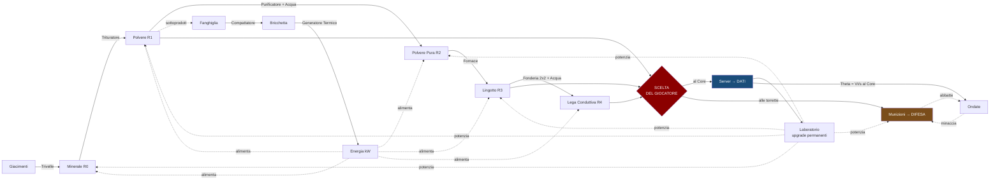
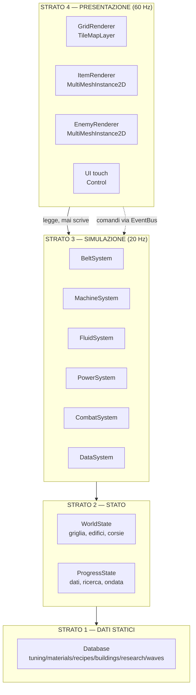

# TDD 00 — Architettura Tecnica
### Factory-Defense Incrementale a Nodi — Godot 4.x / iOS + Android

> **Documento 1 di 3.** Qui c'è *come si costruisce*.
> Il *perché dei numeri* è in [`TDD_01_Economia_Bilanciamento.md`](TDD_01_Economia_Bilanciamento.md).
> L'*ordine in cui costruirlo* è in [`TDD_02_Roadmap_MVP.md`](TDD_02_Roadmap_MVP.md).

---

## 0. Come usare questo pacchetto

```
Giochi/
├── docs/
│   ├── TDD_00_Architettura.md          ← sei qui
│   ├── TDD_01_Economia_Bilanciamento.md
│   ├── TDD_02_Roadmap_MVP.md
│   ├── SAVE_SCHEMA.md
│   └── BALANCE_REPORT.txt              ← output verificato del simulatore
├── data/                               ← copiali in res://data/ nel progetto Godot
│   ├── tuning.json      costanti globali (UNICA fonte di verità)
│   ├── materials.json   materiali e tier di raffinazione
│   ├── recipes.json     ricette con tempi, input, output, kW
│   ├── buildings.json   edifici, dimensioni, porte I/O, costi
│   ├── research.json    albero di ricerca a 12 nodi
│   └── waves.json       nemici e direttore delle ondate
└── tools/
    └── balance_sim.py   simulatore + 13 invarianti di design
```

**Regola operativa numero uno:** nessun numero di bilanciamento viene scritto a mano in GDScript.
Tutto viene caricato da `res://data/*.json`. Se cambi un numero, lo cambi lì, poi lanci:

```bash
python3 tools/balance_sim.py --check
```

Se una delle 13 invarianti fallisce, hai rotto il gioco senza accorgertene. Il comando esce con codice 1.

---

## 1. Il contratto delle tre meccaniche

Il rischio mortale di questo progetto è che le tre anime restino tre giochi incollati. Non succede se rispetti **un solo vincolo strutturale**:

> **Esiste una sola valuta fisica: il materiale. Esiste una sola grandezza che la misura: il Valore Industriale (VI). Difesa e Ricerca sono due sink concorrenti dello stesso flusso di VI.**



Leggi il diagramma partendo dal rombo rosso. **Quel rombo è il gioco.** Tutto il resto è infrastruttura che rende quella scelta interessante.

Le tre proprietà che tengono insieme il sistema — dimostrate numericamente nel documento 01:

| # | Proprietà | Conseguenza di gameplay |
|---|---|---|
| **P1** | I Dati crescono come `2.5^R`, il danno delle munizioni solo come `(R+1)^1.585` | Salire di tier arricchisce molto più di quanto potenzi. Non puoi "techare" per vincere: devi **costruire più fabbrica**. Questa è la regola *"mai un tower defense statico"* resa matematica. |
| **P2** | La minaccia è ancorata a `Θ` = VI/s che **arriva al Core**, con esponente `0.80 < 1` | Espandere la produzione è sempre net-positivo (raddoppi la produzione, la minaccia cresce solo di `2^0.8 = 1.74×`). E bruciare materiale come munizione **abbassa** `Θ`, quindi abbassa le ondate future: il sistema ha una retroazione negativa e non può divergere. |
| **P3** | L'armatura dei nemici è una **riduzione piatta** | La munizione di tier basso è la più efficiente *per VI speso* contro i bersagli nudi, ma diventa inutile contro i corazzati. Ti obbliga a mantenere **due catene di raffinazione attive contemporaneamente**. |

---

## 2. Modello a strati

Il codice è diviso in quattro strati con una regola di dipendenza rigida: **ogni strato conosce solo quello sotto di sé.**



**Perché conta:** lo Strato 3 deve poter girare **senza lo Strato 4**. È ciò che rende possibili (a) il calcolo offline, (b) i test automatici del bilanciamento, (c) l'headless simulation per il tuning. Se un sistema di simulazione tocca un `Node2D` visivo, hai introdotto un bug che pagherai a Sprint 5.

### Struttura del progetto Godot

```
res://
├── autoload/
│   ├── Database.gd          # carica data/*.json, espone lookup tipizzati
│   ├── SimCore.gd           # il tick loop, l'orchestratore
│   ├── EventBus.gd          # signal hub (UI → simulazione)
│   └── SaveManager.gd       # persistenza + calcolo offline
├── sim/
│   ├── world_state.gd       # RefCounted, tutto lo stato mutabile
│   ├── belt_system.gd
│   ├── machine_system.gd
│   ├── fluid_system.gd
│   ├── power_system.gd
│   ├── combat_system.gd
│   ├── data_system.gd
│   ├── flow_field.gd
│   └── offline_solver.gd
├── view/
│   ├── grid_renderer.gd
│   ├── item_renderer.gd
│   ├── enemy_renderer.gd
│   └── build_ghost.gd
├── ui/
│   ├── hud.tscn             # barra inferiore, pollice-first
│   ├── build_menu.tscn
│   ├── lab_graph.tscn       # albero ricerca a nodi (stile Upload Lab)
│   ├── inspector_sheet.tscn # bottom sheet su tap edificio
│   └── offline_report.tscn  # popup di rientro
├── data/                    # ← copia da questo repo
└── main.tscn
```

---

## 3. Il ciclo di simulazione

```gdscript
# autoload/SimCore.gd
extends Node

const TICK_HZ := 20
const TICK_S := 1.0 / TICK_HZ

var world: WorldState
var _accum := 0.0
var _tick_index := 0

# Ordine di esecuzione: NON è arbitrario.
# 1. Energia PRIMA di tutto: definisce sigma, il moltiplicatore di velocità globale.
# 2. Fluidi prima delle macchine: le macchine consumano fluido nello stesso tick.
# 3. Macchine prima dei nastri: un output prodotto questo tick può partire subito.
# 4. Combattimento per ultimo: consuma munizioni già arrivate in torretta.
var _systems: Array

func _ready() -> void:
    world = WorldState.new()
    _systems = [
        PowerSystem.new(world),
        FluidSystem.new(world),
        MachineSystem.new(world),
        BeltSystem.new(world),
        DataSystem.new(world),
        CombatSystem.new(world),
    ]

func _physics_process(delta: float) -> void:
    _accum += delta * world.time_scale   # time_scale = 2.5 durante l'Overclock
    # Cap anti-spirale: se il device ha fatto uno stutter enorme non recuperiamo
    # 300 tick in un frame, perderemmo il frame successivo.
    var budget := 4
    while _accum >= TICK_S and budget > 0:
        _accum -= TICK_S
        budget -= 1
        _tick()

func _tick() -> void:
    _tick_index += 1
    for s in _systems:
        s.tick(_tick_index)
    # Attività a bassa frequenza, sfalsate per non accumularle nello stesso tick
    if _tick_index % 40 == 3:
        world.production_graph.resolve()        # throughput teorico, serve all'offline
    if _tick_index % 600 == 7:
        SaveManager.request_autosave()
```

**Interpolazione visiva.** Lo Strato 4 gira a 60 fps e non deve mai vedere gli item "scattare" a 20 Hz. `SimCore` espone `func tick_alpha() -> float: return _accum / TICK_S`, e i renderer interpolano fra la posizione del tick precedente e quella corrente. Costo: un `PackedVector2Array` in più per i nemici e un `float` per corsia di nastro.

---

## 4. Griglia e piazzamento

Griglia **96×96**, celle da 32 px. Indicizzazione lineare: `idx = y * 96 + x`. Tutto lo stato spaziale sta in `PackedInt32Array` paralleli, non in dizionari:

```gdscript
# sim/world_state.gd
class_name WorldState extends RefCounted

const W := 96
const H := 96
const N := W * H

var terrain      : PackedByteArray   # 0=vuoto 1=roccia 2=giacimento_ferro 3=rame 4=acqua
var building_at  : PackedInt32Array  # id dell'edificio che occupa la cella, -1 se libera
var buildings    : Array[Building]   # indicizzato per id, con buchi riusati da free_ids

@inline func cell(x: int, y: int) -> int: return y * W + x
```

**Perché array paralleli e non `Dictionary`:** un `Dictionary` in GDScript costa ~5-10× un accesso ad array per lookup, e la simulazione fa centinaia di migliaia di lookup al secondo. Questa è la singola decisione che più incide sul frame rate su un Android di fascia media.

### Piazzamento multi-cella e rotazione

Un edificio `size = [w, h]` con rotazione `r ∈ {0,1,2,3}` occupa un rettangolo ruotato. Le **porte** sono definite in coordinate locali non ruotate in `buildings.json` e trasformate a runtime:

```gdscript
func rotate_local(p: Vector2i, size: Vector2i, r: int) -> Vector2i:
    match r:
        0: return p
        1: return Vector2i(size.y - 1 - p.y, p.x)
        2: return Vector2i(size.x - 1 - p.x, size.y - 1 - p.y)
        _: return Vector2i(p.y, size.x - 1 - p.x)
```

**Validazione del piazzamento** (deve girare a ogni frame durante il drag, quindi va tenuta sotto i 0,1 ms):
1. Tutte le celle del footprint dentro i limiti e con `building_at == -1`.
2. Se `must_be_on_patch`, tutte le celle del footprint sul giacimento del tipo giusto.
3. Il costo in materiali è disponibile nell'inventario globale.

Se una condizione fallisce, il **ghost diventa rosso e la vibrazione aptica leggera scatta una sola volta** al passaggio da valido a non valido. Mai un popup di errore: su mobile un popup durante un drag è una micro-aggressione.

---

## 5. Nastri — il sistema critico per le prestazioni

È il sistema che decide se il gioco gira a 60 fps su uno Snapdragon 730. Ha due regole non negoziabili:

> **Un item su un nastro non è mai un `Node`.** È un byte in un array.
> **Tutti gli item del mondo si disegnano con una sola draw call.**

### Struttura dati: la Corsia (`BeltLane`)

Una **corsia** è una catena massimale di celle di nastro che si alimentano in sequenza. Si spezza a ogni ripartitore, curva verso un'altra corsia, o ingresso di macchina.

```gdscript
class_name BeltLane extends RefCounted

const SLOTS_PER_TILE := 3
const FP_ONE := 256                  # fixed point: 1 slot = 256 unità

var tiles      : PackedInt32Array    # celle, dalla coda (input) alla testa (output)
var slots      : PackedByteArray     # material_id + 1, 0 = vuoto. size = tiles.size() * 3
var accum      : int = 0             # accumulatore fixed-point
var speed_fp   : int                 # slot per tick, in fixed point
var out_target : int = -1            # id edificio/corsia a valle, -1 = nessuno
```

### Avanzamento: scansione dalla testa alla coda

```gdscript
func tick(world: WorldState) -> void:
    accum += speed_fp
    while accum >= FP_ONE:
        accum -= FP_ONE
        _step(world)

func _step(world: WorldState) -> void:
    var last := slots.size() - 1

    # 1. La testa prova a uscire. Se il destinatario rifiuta, la corsia ingorga.
    if slots[last] != 0:
        if not world.try_push(out_target, slots[last] - 1):
            return                       # ingorgo: NESSUN item si muove. Corretto e O(1).
        slots[last] = 0

    # 2. Tutti gli altri avanzano di uno slot. Scansione all'indietro = zero collisioni.
    for i in range(last, 0, -1):
        if slots[i] == 0 and slots[i - 1] != 0:
            slots[i] = slots[i - 1]
            slots[i - 1] = 0
    # slots[0] resta libero per l'inserimento a monte in questo stesso tick.
```

**Analisi di costo — il motivo per cui questa soluzione semplice è quella giusta.**
`_step()` costa `O(numero di slot della corsia)`, ma **non gira a 20 Hz**: gira alla velocità del nastro. Un nastro base fa 6 slot/s, quindi `_step()` viene chiamata 6 volte al secondo, non 20.

Con il budget del documento — 1 500 celle di nastro × 3 slot = 4 500 slot — il costo totale è:

```
4 500 slot × 6 step/s ≈ 27 000 iterazioni/s
```

GDScript tipizzato ne regge svariati milioni al secondo. **Siamo tre ordini di grandezza sotto il limite.** Non ottimizzare questo prima di aver misurato.

> **Trigger di upgrade documentato.** Se il profiler segna `BeltSystem > 1,5 ms/tick` (probabile solo oltre le ~6 000 celle di nastro), sostituisci la scansione con il modello a *buffer circolare + indice di ingorgo*: l'avanzamento di una corsia non ingorgata diventa `origin = (origin - 1 + cap) % cap`, cioè `O(1)`. Non farlo prima: raddoppia la complessità del codice per un guadagno che oggi non ti serve.

### Rendering: una sola draw call

```gdscript
# view/item_renderer.gd
extends MultiMeshInstance2D

func _process(_d: float) -> void:
    var alpha := SimCore.tick_alpha()
    var k := 0
    for lane in SimCore.world.lanes:
        var sub := float(lane.accum) / BeltLane.FP_ONE      # avanzamento sub-slot
        for i in lane.slots.size():
            var m := lane.slots[i]
            if m == 0: continue
            multimesh.set_instance_transform_2d(k, Transform2D(0.0, lane.world_pos(i, sub)))
            multimesh.set_instance_color(k, Database.material_color(m - 1))
            k += 1
    multimesh.visible_instance_count = k
```

`multimesh.instance_count` va allocato una sola volta a 6 000 e mai riallocato: usa `visible_instance_count` per il numero effettivo. Riallocare un MultiMesh ogni frame provoca stutter garantito su mobile.

---

## 6. Macchine e grafo di produzione

Ogni macchina è una **macchina a stati a 3 stati** guidata da un contatore di tick — nessun timer, nessun `await`, nessuna coroutine.

```gdscript
enum { IDLE, WORKING, BLOCKED }

func tick_machine(b: Building, sigma: float) -> void:
    match b.state:
        IDLE:
            if _has_all_inputs(b):
                _consume_inputs(b)
                b.ticks_left = b.recipe_ticks       # calcolato una volta al cambio ricetta
                b.state = WORKING
        WORKING:
            # sigma = soddisfazione della rete elettrica (0..1).
            # Il brownout NON ferma le macchine: le rallenta. È la differenza fra
            # "il gioco è rotto" e "devo ingegnerizzare meglio l'energia".
            b.progress_fp += int(sigma * b.speed_mult * 256.0)
            while b.progress_fp >= 256 and b.ticks_left > 0:
                b.progress_fp -= 256
                b.ticks_left -= 1
            if b.ticks_left == 0:
                b.state = BLOCKED
        BLOCKED:
            if _push_all_outputs(b):                # tutto o niente
                b.state = IDLE
```

**Dettaglio che evita un intero genere di bug:** lo stato `BLOCKED` esiste apposta perché una macchina con più output (il Purificatore fa prodotto **+ fanghiglia**) non deve poter espellere metà del risultato. O escono entrambi, o il ciclo resta trattenuto. Senza questo, un nastro della fanghiglia intasato fa scomparire silenziosamente il sottoprodotto e il tuo ciclo energetico non torna più.

### Il grafo di produzione e il risolutore topologico

Ogni 2 secondi (`_tick_index % 40`) il mondo calcola il **throughput teorico a regime** di tutta la fabbrica. Serve a tre cose: il pannello di analisi ("qual è il mio collo di bottiglia?"), il calcolo offline, e il valore di `Θ` che alimenta il direttore delle ondate.

```gdscript
# 1. Costruisci il DAG: nodo = macchina, arco = corsia di nastro/condotto.
# 2. Ordinamento topologico (Kahn). I cicli — es. fanghiglia → energia → purificatore —
#    vengono spezzati marcando l'arco di retroazione e risolvendo iterativamente
#    con 3 passate: converge perché ogni ciclo ha un fattore di guadagno < 1.
# 3. Propaga in avanti: rate_out = min(rate_max_macchina, rate_in / consumo_per_ciclo)
# 4. Il minimo lungo la catena è il collo di bottiglia. Marcalo: la UI lo colora.
```

Questo risolutore è **lo stesso codice** che poi userà l'`OfflineSolver`. Scriverlo una volta sola è metà del valore architetturale del progetto.

---

## 7. Fluidi

I fluidi sono la meccanica dove è più facile scivolare nella micro-gestione snervante. La regola: **nessuna simulazione di pressione per-cella.**

Modello: una **rete di fluido** è un insieme connesso di condotti e porte. Ha `volume_max = n_condotti × 600 mB` e un solo `volume_corrente`. Per tick:

```
1. Le pompe versano nella rete    (cap: volume_max)
2. Le macchine prelevano in ordine di distanza dalla pompa
3. Se la richiesta supera la disponibilità → tutte le macchine ricevono
   la stessa frazione   phi = disponibile / richiesto
   e girano a velocità   min(sigma_energia, phi)
```

Il giocatore percepisce una rete idraulica realistica (aggiungere condotti aumenta il buffer, una pompa lontana risponde più lentamente) senza che tu abbia scritto un solo solver di fluidodinamica. La ricostruzione della rete avviene con un flood-fill solo quando un condotto viene aggiunto o rimosso.

---

## 8. Energia — il modello a brownout

Una **rete elettrica** è un insieme connesso di pali e consumatori. Per tick:

```
supply_lordo = somma dei kW dei generatori attivi (con combustibile)
perdita      = min(0.35, 0.008 × distanza_manhattan_dal_generatore_piu_vicino)
supply_eff   = somma dei kW × (1 - perdita) di ciascun generatore
demand       = somma dei kW nominali dei consumatori attivi × mult_overclock
sigma        = min(1.0, supply_eff / demand)
```

`sigma` viene passato a **ogni** macchina della rete e ne moltiplica la velocità. Conseguenze di design volute:

- Sottodimensionare l'energia **non rompe niente**, rallenta tutto in modo proporzionale e leggibile. Zero frustrazione, massima leggibilità.
- La distanza conta davvero (fino al 35% di perdita), quindi conviene generare vicino a dove si consuma → nasce una vera geografia industriale.
- **L'Overclock alza la domanda del 25%**: se la tua rete è satura, l'abilità attiva ti manda in brownout e ti dà meno di quanto ti aspettavi. L'abilità "gratis" ha un costo ingegneristico. Questo è il modo giusto di integrare un'abilità idle in un factory game.

La rete si ricalcola solo su modifica della topologia (flood-fill, debounced 200 ms), mai per tick.

---

## 9. Difesa

### Pathfinding: flow field, mai A* per nemico

Con 250 nemici simultanei, un A* per unità è fuori discussione su mobile. Si calcola **un solo campo di flusso** per tutta la mappa, con Dijkstra a partire dal Core:

```gdscript
# sim/flow_field.gd
var cost      : PackedInt32Array   # 96*96, distanza pesata dal Core
var direction : PackedByteArray    # 96*96, 0..7 = direzione verso il Core

# Costo di attraversamento di una cella:
#   vuota          → 10
#   nastro/tubo    → 12   (i nemici li calpestano, li danneggiano poco)
#   muro           → 10 + hp / 4      ≈ 72 per un muro da 250 hp
#   macchina       → 10 + hp / 4
# I muri NON bloccano: rendono la via costosa. Il nemico sceglie il percorso
# di minor costo totale, cioè "sfonda dove è meno difeso" — comportamento Mindustry.
```

Ricalcolo **debounced a 500 ms** dopo l'ultima modifica agli edifici, eseguito su `WorkerThreadPool` in modo che il frame non ne risenta. Costo: un Dijkstra su 9 216 celle, ~2-4 ms su un thread di background. I nemici leggono `direction[idx]` in `O(1)`.

I **Volanti ignorano il flow field**: puntano il Core in linea retta. È l'unico modo per impedire al giocatore di fortificare un solo lato e vincere.

### Torrette e munizioni

```gdscript
func tick_turret(t: Building) -> void:
    if t.ammo_buffer <= 0: return
    var target := _acquire_target(t)         # griglia spaziale 8x8, non ciclo su tutti
    if target == -1: return
    t.cooldown -= 1
    if t.cooldown > 0: return
    t.cooldown = t.shot_period_ticks

    # IL CUORE DEL COLLEGAMENTO FRA I TRE GENERI:
    # il danno dipende dal TIER DI RAFFINAZIONE del materiale caricato.
    var mat := t.ammo_material
    var mult := pow(Database.tier(mat) + 1.0, Database.BETA)    # BETA = 1.585
    var raw  := t.damage_per_shot * mult * (1.0 + 0.06 * Research.ballistics_level)
    var dmg  := maxf(raw * 0.15, raw - Enemies.armor(target))   # armatura piatta, pavimento 15%
    Enemies.apply_damage(target, dmg)
    t.ammo_buffer -= t.ammo_per_shot
```

Acquisizione bersaglio tramite **griglia spaziale a celle 8×8**: ogni nemico si registra nella sua cella, la torretta interroga solo le 9 celle nel suo raggio. Costo per torretta per colpo: ~O(nemici nel raggio), non O(tutti i nemici).

### Il direttore delle ondate

```gdscript
func spawn_wave(n: int) -> void:
    var theta := world.theta_rolling_60s          # VI/s che arriva al Core
    var budget := 150.0 \
        * pow(1.0 + 0.22 * n, 1.55) \
        * pow(1.0 + theta / 20.0, 0.80)
    var mix := Database.wave_mix(n)
    # Spende il budget in HP acquistando archetipi secondo il mix.
    # Spawna in 4 ondate parziali distanziate 3 s, dai lati attivi
    # (1 lato dall'ondata 1, 2 dalla 8, 3 dalla 20, 4 dalla 34).
```

L'esponente `0.80` è la costante più importante del gioco dopo `λ = 2.5`. Le sue conseguenze sono derivate nel documento 01, §3.

---

## 10. Dati, Core, Laboratorio

Il **Rack Server** consuma qualsiasi solido e lo converte in Dati:

```gdscript
func tick_server(s: Building) -> void:
    var consumed := 0.0
    while consumed < s.throughput_per_tick and s.input_buffer.size() > 0:
        var mat: int = s.input_buffer.pop_front()
        world.data += Database.vi(mat) * Research.data_per_vi   # vi = base * 2.5^tier
        world.theta_accumulator += Database.vi(mat)
        consumed += 1.0
```

`theta_accumulator` alimenta la media mobile a 60 s che il direttore delle ondate legge come `Θ`. **Finestra di 60 secondi, non istantanea**: altrimenti il giocatore potrebbe spegnere i server 5 secondi prima di ogni ondata per abbassare la difficoltà. Con la media mobile quell'exploit costa più di quanto renda.

### Il Laboratorio come grafo a nodi

L'interfaccia del Laboratorio è un `Control` a scorrimento con pinch-zoom che disegna i 12 nodi alle posizioni `grid` di `research.json`, collegati da linee. Tre stati visivi: **bloccato** (grigio, prereq mancanti), **disponibile** (bordo pulsante, costo leggibile), **acquisito** (pieno, con l'effetto in chiaro). Tap su un nodo → bottom sheet con descrizione ed effetto numerico esatto; tap su "Ricerca" → acquisto immediato, niente timer.

**Niente timer di ricerca.** In un factory game il collo di bottiglia deve essere la fabbrica, non un countdown. Aggiungere timer alla ricerca è il modo più rapido per trasformare questo gioco in un idle mobile predatorio.

---

## 11. Progressione offline — la Modalità Sentinella

Il conflitto: onde a ciclo continuo (la tua scelta) contro idle sicuro (il tuo vincolo). Si risolve così:

| Cosa | A gioco chiuso |
|---|---|
| Base e Core | **Invulnerabili.** Nessun nemico esiste. |
| Timer ondate | **Congelato.** Rientri all'ondata N esatta da cui eri uscito. |
| Produzione | Gira al `η_offline` del regime a cui girava (40%, 55% dopo *Uplink Autonomo*). |
| Munizioni | **Non consumate** (nessuno spara). |
| Tetto | 8 h (12 h dopo *Uplink Autonomo*). |

```gdscript
# sim/offline_solver.gd
func resolve(dt_seconds: float) -> Dictionary:
    var cap := Research.offline_cap_hours * 3600.0
    var t := clampf(dt_seconds, 0.0, cap)
    var eta := Research.offline_efficiency

    # NON si moltiplica semplicemente la produzione per il tempo: si usa il
    # throughput risolto dal grafo topologico, così i colli di bottiglia,
    # i limiti dei silo e la carenza di energia valgono anche offline.
    var solved := world.production_graph.steady_state()
    var report := {}
    for mat_id in solved.rates:
        var produced: float = solved.rates[mat_id] * t * eta
        var space: float = world.storage_space_for(mat_id)
        report[mat_id] = minf(produced, space)     # i silo pieni fermano la linea
        world.add_material(mat_id, report[mat_id])
    report["data"] = solved.data_rate * t * eta
    world.data += report["data"]
    report["capped"] = dt_seconds > cap
    return report
```

**Il tetto ai silo non è un dettaglio:** senza di esso l'offline produce risorse infinite e la parte "fabbrica" del gioco muore. Con esso, ampliare lo stoccaggio diventa una scelta di progressione idle sensata — ed è il motivo per cui il Silo è nell'MVP.

Al rientro, un `offline_report.tscn` mostra il riepilogo in stile Upload Lab: tempo trascorso, materiali accumulati, Dati guadagnati, e — se `capped` è vero — un avviso onesto *"produzione ferma da 3 h 20 m: il tetto è di 8 h"*.

### Integrità del tempo

```gdscript
var dt := Time.get_unix_time_from_system() - save.last_exit_unix
if dt < 0.0:
    dt = 0.0                      # orologio spostato indietro → nessun accredito
    save.clock_anomalies += 1
```

Essendo un gioco single-player offline, questa è una difesa contro il *time-travel casuale*, non contro un attaccante determinato: chi modifica il file di salvataggio vince comunque. Un anti-cheat reale richiede un server autoritativo ed è fuori dallo scope dell'MVP — non fingere il contrario nel codice.

---

## 12. Persistenza

Formato: **binario** via `FileAccess.store_var()` (veloce, compatto), con esportazione JSON opzionale per il debug. Scrittura su `WorkerThreadPool` per non bloccare il frame. Schema completo e regole di migrazione: [`SAVE_SCHEMA.md`](SAVE_SCHEMA.md).

Regola di sopravvivenza: **ogni salvataggio porta un `version: int`**, e `SaveManager` contiene una catena di funzioni `_migrate_1_to_2()`, `_migrate_2_to_3()`. Il giorno che pubblichi la prima build su TestFlight, questo smette di essere facoltativo.

---

## 13. UI/UX touch

### Mappa delle gesture

| Gesture | Senza strumento attivo | Con strumento attivo |
|---|---|---|
| Tap | Apri l'ispettore dell'edificio | Piazza un edificio |
| Drag | Pan della camera | **Costruisci trascinando** (nastri, muri, condotti, pali) |
| Pinch | Zoom | Zoom |
| Long press | Menu rapido (copia, elimina, ruota) | Annulla lo strumento |
| Two-finger tap | — | Ruota di 90° |

### Costruzione dei nastri a trascinamento

È la meccanica che decide se il gioco è piacevole su un telefono. Specifica:

1. Il dito tocca la cella di partenza → si aggancia allo **snap-to-grid** (nessuna precisione richiesta: si prende la cella più vicina al centro del tocco).
2. Durante il trascinamento, il percorso viene **auto-instradato a L** (prima l'asse con la delta maggiore, poi l'altro). Il giocatore non deve disegnare l'angolo: lo ottiene gratis.
3. Il ghost mostra il percorso completo con le frecce di direzione già orientate, e il **costo totale in materiali** in un badge accanto al dito ma spostato di 60 px in alto — mai sotto il polpastrello.
4. Al rilascio si costruisce tutto in un colpo. Se mancano materiali, si costruisce **il tratto che ti puoi permettere** partendo dalla sorgente, e il resto resta come "progetto" tratteggiato.
5. Compare per 5 secondi un pulsante **ANNULLA** in basso a sinistra, raggiungibile col pollice.

Il punto 4 è deliberato: interrompere una costruzione con un errore è la cosa che rende sgradevoli i factory game su mobile.

### Layout

- **Barra inferiore fissa**, altezza 88 px, 5 pulsanti: `Logistica · Produzione · Energia · Difesa · Dati`. Tutti raggiungibili col pollice di una mano sola.
- **Laboratorio** e **Overclock**: due pulsanti circolari in basso a destra, sopra la barra.
- **HUD in alto** minimale: Dati/s, ondata corrente + countdown, `σ` della rete elettrica come barra sottile. Tap sull'HUD → pannello di analisi con i colli di bottiglia.
- **Safe area:** su iPhone con notch e su Android con gesture bar, l'intera UI rispetta `DisplayServer.get_display_safe_area()`. Da configurare a Sprint 0, non alla fine.

---

## 14. Budget prestazionale

Target: **60 fps su iPhone XR (A12) e Snapdragon 730**, che nel 2026 rappresentano ancora il ~15% del parco installato.

| Voce | Budget | Strategia |
|---|---|---|
| Tick logico | 20 Hz, ≤ 5 ms/tick | un solo `_physics_process`, zero `_process` per entità |
| Edifici simulati | ≤ 2 000 | dirty set: solo le macchine con input o output cambiati |
| Item su nastro | ≤ 6 000 | `PackedByteArray`, mai `Node` |
| Draw call item | 1 | `MultiMeshInstance2D` con `visible_instance_count` |
| Nemici | ≤ 250 | MultiMesh + flow field condiviso |
| Flow field | ≤ 1 ogni 500 ms | `WorkerThreadPool`, debounced |
| Grafo produzione | 1 ogni 2 s | Kahn incrementale |
| Salvataggio | 1 ogni 30 s, < 8 ms | thread separato, binario |
| Memoria | < 250 MB | atlas unico, nessuna texture > 2048² |

**Le tre metriche da misurare sul device fin dallo Sprint 2** — non a fine progetto:

1. `ms/tick` del `SimCore` (target < 5 ms al 90° percentile).
2. Draw call totali per frame (target < 40).
3. Millisecondi persi sul frame peggiore in 60 s di gioco (target < 33 ms, cioè mai due frame saltati di fila).

Se una di queste tre sfora, si ferma lo sprint e si ottimizza. Un factory game che scatta è un factory game che nessuno finisce.

---

## 15. Rischi tecnici e mitigazioni

| # | Rischio | Probabilità | Mitigazione |
|---|---|---|---|
| R1 | GDScript troppo lento sui nastri con fabbriche grandi | Media | Il modello a scansione è già 1 000× sotto budget. Se sfora: buffer circolare `O(1)`, poi GDExtension in C++ solo per `BeltSystem`. |
| R2 | La complessità "GregTech" diventa micro-gestione | **Alta** | Ogni meccanica profonda deve essere **da progettare una volta, poi automatica**: nessun input manuale ricorrente. Test: se una meccanica richiede un tap più di una volta ogni 10 minuti, va ridisegnata. |
| R3 | Il flow field ricalcolato troppo spesso durante la costruzione | Media | Debounce 500 ms + thread. Durante un drag-build non si ricalcola affatto. |
| R4 | L'offline rompe il bilanciamento (troppo o troppo poco) | Media | `η` e il cap sono in `tuning.json` e verificati dal simulatore. Modificabili senza toccare codice. |
| R5 | Il giocatore non capisce perché deve raffinare | **Alta** | Il pannello di analisi mostra sempre *"Stai conferendo Minerale Grezzo: 2 Dati/s. Con la catena completa: 62 Dati/s (×31)"*. La lezione va **mostrata in numeri**, non spiegata a parole. |
| R6 | Salvataggi rotti fra le build | Alta | `version` + catena di migrazioni dallo Sprint 1. |
| R7 | Scope creep (multi-blocchi giganti, gas, voltaggi) | **Molto alta** | Tutto ciò che non è nella roadmap del documento 02 va in un file `POST_MVP.md`, non nel codice. |

---

**Prosegui con:** [`TDD_01_Economia_Bilanciamento.md`](TDD_01_Economia_Bilanciamento.md) per la derivazione dei numeri, oppure salta direttamente a [`TDD_02_Roadmap_MVP.md`](TDD_02_Roadmap_MVP.md) se vuoi iniziare a programmare adesso.
